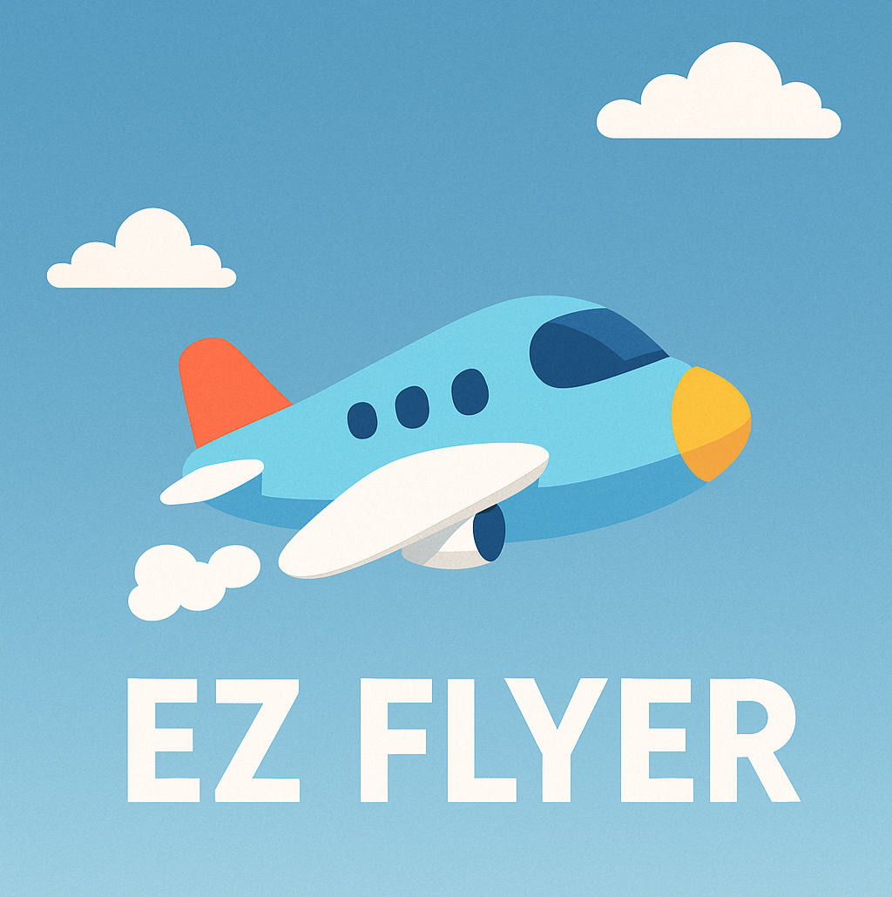

# EZ Flyer

version：1.0.0  
## 下載
可直接於手機安裝apk檔案

---

## 開發理念
這是我第一次寫遊戲，我認為像是星際爭霸戰、Jolly Jumpers 的混和遊戲作為入門比較合適。  
主要包含背景、物件，以及障礙物的移動與狀態計算，這部分是開發上的挑戰。  

---

## 核心設計

1. 透過 `ObstacleManager` 管理障礙物的生成、移動與回收，並根據難度調整障礙物速度與密度。
2. 使用 `onTouchEvent()` 處理玩家拖曳目標與暫停功能。  
   背景與圖片部分使用 `Canvas` 和 `Paint`，並用 `BitmapFactory` 處理背景圖與飛機圖。
3. 利用 `Rect.intersects()` 檢測障礙物與玩家的碰撞（矩形檢測）。
4. 使用 `MainThread` 控制遊戲更新與繪製迴圈，調節 FPS（Frames Per Second）確保遊戲順暢。
5. 使用 `MediaPlayer` 加入背景音樂，當遊戲暫停時音樂也會暫停，其他時間則持續播放。

---

## 未來可改進部分

1. **玩家等級與分數機制**  
   使用 `SharedPreferences` 或資料庫（如 SQLite）儲存玩家最高分與進度。  
   增加分級系統，根據分數解鎖新飛機造型。
   
2. **動態背景**  
   增加動態滾動的背景效果（如雲層、地面），隨玩家前進移動，增強代入感。
   
3. **網路功能與排行榜**  
   使用 Firebase Realtime Database 或 REST API，讓玩家可與其他玩家競爭分數、即時排名。
   
4. **動態感測器**  
   透過手機的水平儀控制飛機方向（雖然目前未實作，但考慮到距離過大可能導致輸掉遊戲）。

---
